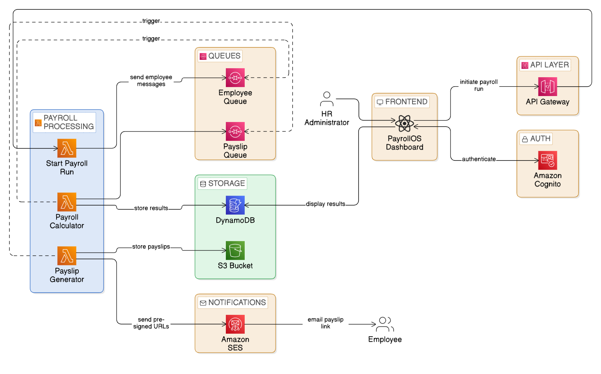

# PayrollOS

### Automated Payroll Processing and Payslip Delivery Engine

PayrollOS is a **serverless payroll automation system** built using **Amazon Web Services (AWS)**.  
The platform automates monthly payroll processing by calculating employee salaries, applying deductions, generating payslips, and securely delivering them to employees via email.

The system replaces manual spreadsheet-based payroll workflows with a **scalable, event-driven architecture**.

---

# Live Deployment

The HR dashboard is deployed using **Amazon S3 Static Website Hosting**.

**Live Application**

http://payroll-host-bucket.s3-website.ap-south-1.amazonaws.com

---

# Frontend Screenshot

**Note:**  
For testing purposes, all employee records currently use my email address so that generated payslips can be delivered to a single inbox.  
In a real deployment, each employee would have their **own email address**, and employee records would be **inserted directly into the DynamoDB tables by the HR system**, not through the frontend interface.

---

# Architecture

PayrollOS follows a **serverless event-driven architecture** where AWS services handle authentication, backend processing, distributed job execution, data storage, and email delivery.

Main system components:

- **Amazon Cognito** – HR authentication
- **Amazon API Gateway** – REST API endpoints
- **AWS Lambda** – Payroll processing and backend logic
- **Amazon SQS** – Distributed payroll job processing
- **Amazon DynamoDB** – Payroll and employee data storage
- **Amazon S3** – Payslip storage and frontend hosting
- **Amazon SES** – Email delivery of payslips

Architecture Diagram:

---

# AWS Services Used

| Service | Purpose |
|-------|-------|
| Amazon Cognito | HR authentication |
| Amazon API Gateway | REST APIs for frontend communication |
| AWS Lambda | Payroll calculation and processing |
| Amazon SQS | Distributed processing of payroll jobs |
| Amazon DynamoDB | Payroll and employee data storage |
| Amazon S3 | Payslip storage and frontend hosting |
| Amazon SES | Email delivery of payslips |

---

# Features

### Secure Authentication
- HR login using **Amazon Cognito**
- Email verification using OTP
- Secure access to payroll dashboard

### Automated Payroll Processing
- HR can trigger payroll runs from the dashboard
- Payroll tasks are distributed using **Amazon SQS**
- Lambda workers process payroll calculations in parallel

### Payslip Generation
- Payslips are generated automatically after payroll processing
- Payslips include salary breakdown, deductions, and net pay
- Documents are stored securely in **Amazon S3**

### Secure Payslip Delivery
- Employees receive payslips through **Amazon SES**
- Access provided via **temporary pre-signed S3 URLs**

### Payroll Run Monitoring
- HR dashboard displays payroll run history
- Track payslip generation status
- View employee payroll results

---

# Payroll Workflow

1. HR logs into the PayrollOS dashboard using **Amazon Cognito**
2. HR initiates a payroll run from the dashboard
3. **API Gateway** triggers the payroll start Lambda
4. A payroll **run_id** is generated
5. Messages are sent to **Amazon SQS** (one per employee)
6. Worker Lambdas calculate payroll for each employee
7. Payroll results are stored in **Amazon DynamoDB**
8. Payslip generation is triggered
9. Payslips are generated and stored in **Amazon S3**
10. Secure **pre-signed URLs** are created
11. **Amazon SES** sends the payslip link to the employee
